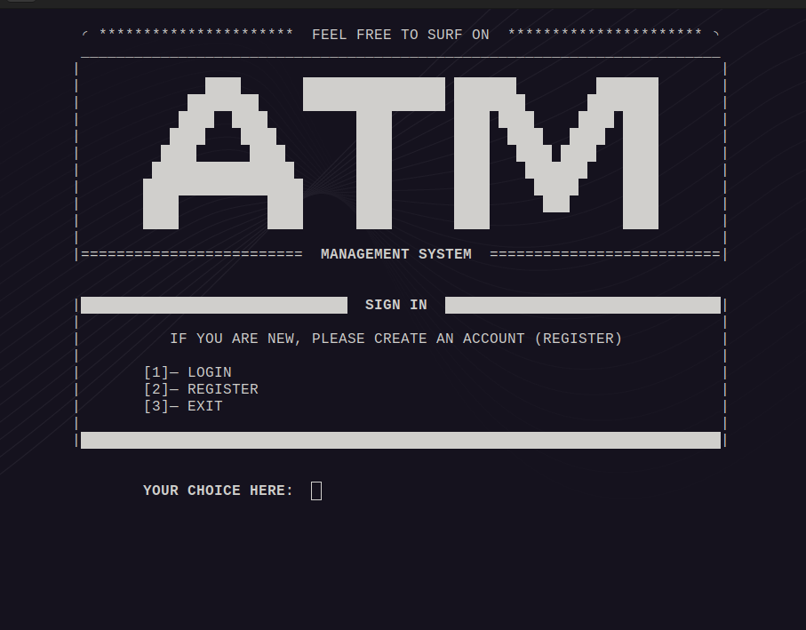
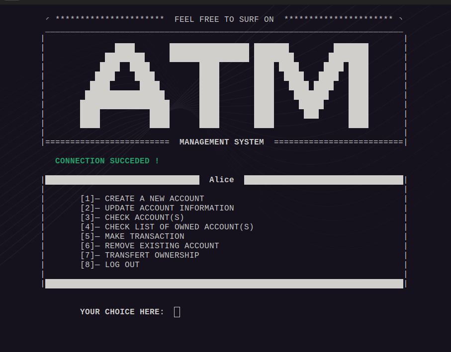
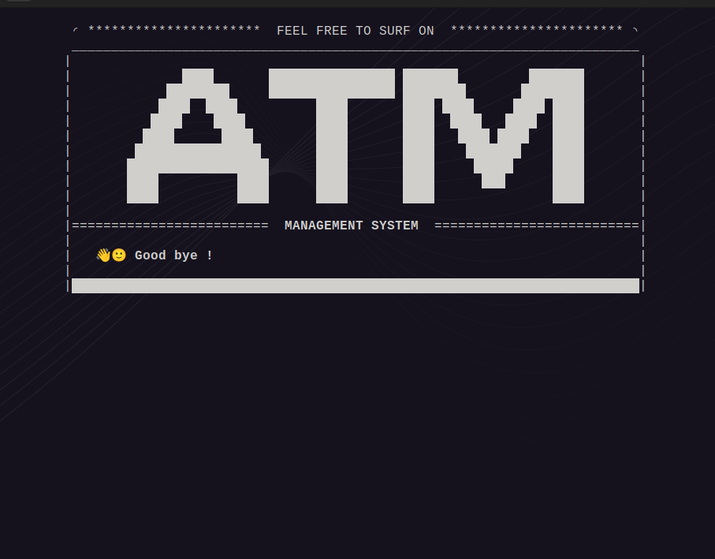

<h1 align="center">🏧-MANAGEMENT-SYSTEM 🏦</h1>

This project is an **[ATM](https://en.wikipedia.org/wiki/Automated_teller_machine)** (Automated Teller Machine) **management system** implemented in C language. The system simulates basic functionalities of an ATM, allowing users to perform operations such as checking their account balance, withdrawing cash, depositing funds, and much more. This program serves as a simple example of how such systems can be structured and provides a foundational understanding of basic ATM operations.

### Users can do the following actions :
- Login / Register
- Create a new account
- Check the details of existing accounts
- Update information of existing accounts
- Remove existing accounts
- Check list of owned accounts
- Make transactions

## Table of Contents
- [Requirements](#requirements)
- [Setup and usage](#setup-and-usage)
- [Implementation details](#implementation-details)
  - [File system](#file-system)
  - [Directory descriptions](#directory-descriptions)

## Requirements
- A ***C compiler*** (e.g., GCC)
- Basic knowledge of C programming

## Setup and usage

### 1. Clone the repository :
```bash
git clone https://github.com/8lkc/01-edu.git
```

### 2. Navigate to the project directory :
```bash
cd ATM-MANAGEMENT-SYSTEM
```

### 3. Run the program :
Invoke the `makefile` that will compile the ***C source files*** to create an executable file, then run the created file.
```bash
make
```

### Here are a few screenshots by way of illustration
<div style="display: flex">
    
    
    
</div>

## Implementation details
The ***ATM Management System*** is structured to maintain modularity and ease of maintenance. The source code is organized into different directories, each serving a specific purpose.

### File system
```bash
.
├── database
│   ├── records.txt
│   └── users.txt
├── library
│   ├── header.h
│   └── source
│       ├── features.c
│       ├── helpers.c
│       ├── system.c
│       └── utilities.c
├── main.c
├── makefile
├── README.md
└── task.todo
```

### Directory descriptions
- **database :** Contains the data files used by the system to store user records and transaction details.
  - `users.txt`: Stores all information about each user.
  - `records.txt`: Stores all information relevant to the accounts for each user.
- **library :** Contains the header file and the source files with the implementation of various functionalities and needed utilities.
  - `header.h`: Declares the functions and data structures used throughout the program.
  - **source :** Contains the implementation of various features and utility functions.
    - `features.c`: Implements the core features of the *ATM system*, such as transactions, accounts details checking, etc.
    - `helpers.c`: Contains helper functions that support the main features, such as input validation and file operations.
    - `system.c`: Implements internal system-level functions.
    - `utilities.c`: Provides utility functions that are used across different modules of the program.
- `main.c`: The main entry point of the program. It initializes the system and handles the user interface, guiding the user through different operations.
- `makefile`: A script used by the make build automation tool to compile the program. It defines the rules for building the executable from the source files, and then run it.
- `task.todo`: A text file listing tasks and features to be implemented throughout the development process.

---
